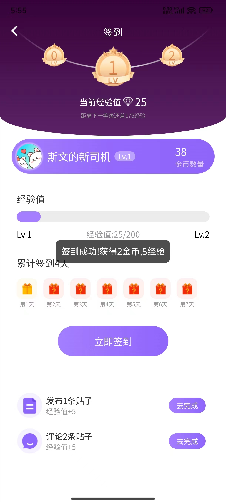
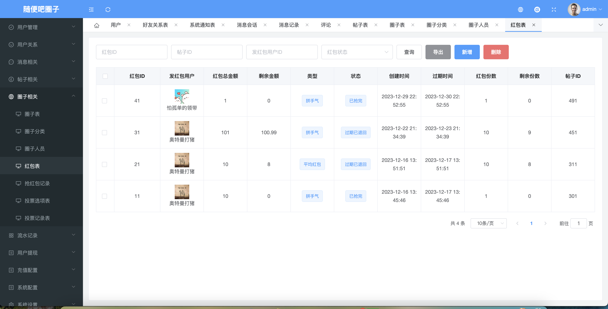

### 项目说明
- JAVA+unipp开发的chatgpt程序
- 开发脚手架基于人人开源 https://gitee.com/renrenio/renren-security
- java开发的私密圈子小程序  前端使用uniapp   可打包多端运行  APP  H5  公众号  小程序等 ,三级分销,卡密充值,私密圈,付费圈,付费贴,红包贴等
- 具体功能看演示(演示为商业版本)
- 演示地址：https://bbs.suibianba.cn
- 后台地址:http://admin.suibianba.cn/
- 账号/密码:test
- 后台页面仓库地址 https://gitee.com/shican1234/chatgpt-admin-ui.git
- JAVA仓库地址 https://gitee.com/shican1234/quanzi-java.git
<br>


**本地JAVA部署**
- 通过git下载源码
- idea、eclipse需安装lombok插件，不然会提示找不到entity的get set方法
- 创建数据库renren_security，数据库编码为UTF-8
- 执行/db/mysql.sql文件，初始化数据
- 后台管理默认账号密码为admin
- 修改application-dev.yml文件，更新MySQL账号和密码
- 运行后在后台管理-->系统设置-->参数管理对应修改公众号/小程序等APPID

**本地后台管理VUE运行**
- 您需要提前在本地安装[Node.js](https://nodejs.org/en/)，版本号为：[12.x、14.x]，再使用[Git](https://git-scm.com/)克隆项目或者直接下载项目后，然后通过`终端命令行`执行以下命令。

```bash
# 切换到项目根目录

# 安装插件
npm install

# 启动项目
npm run serve
```
**本地UNIAPP代码运行**
- 修改utils/lib/config.js中的request为你的API地址
- 修改utils/lib/config.js中的upload中的域名改成API域名
- 修改manifest.json中的小程序appid
<br>

### 项目截图(截图内容为商业版本)


**移动端截图**





**后台页面**





### 普通版本与商业版的区别
|  功能    |  基础版本   |  商业版   |
| --- | --- | --- |
|   用户管理  |   ✅  |   ✅  |
|   圈子管理  |   ✅  |   ✅  |
|   帖子管理  |   ✅  |   ✅  |
|   短信登入  |   ✅  |   ✅  |
|   邮箱登入 |   ✅  |   ✅  |
|   快捷登入  |   ✅  |   ✅  |
|   VIP充值  |   ❌  |   ✅  |
|   付费贴  |   ❌  |   ✅  |
|   红包贴  |   ❌  |   ✅  |
|   付费圈  |   ❌  |   ✅  |
|   开屏广告  |   ❌  |   ✅  |
|   私密圈  |   ❌  |   ✅  |
|   三级分销  |   ❌  |   ✅  |
|   积分签到  |   ❌  |   ✅  |
|   系统消息 |   ❌  |   ✅  |
|   好友板块  |   ❌  |   ✅  |
|   私信聊天  |   ❌  |   ✅  |
|   卡密兑换 |   ❌  |   ✅  |
|   分销提现  |   ❌  |   ✅  |
|   置顶加精  |   ❌  |   ✅  |
|   帖子打赏 |   ❌  |   ✅  |
|   即时通讯 |   ❌  |   ✅  |
|   二开帮助  |   ❌  |   ✅  |
|   专业售后服务  |   ❌  |   ✅  |


<br>


### 详细可联系
VX:shican19930703

